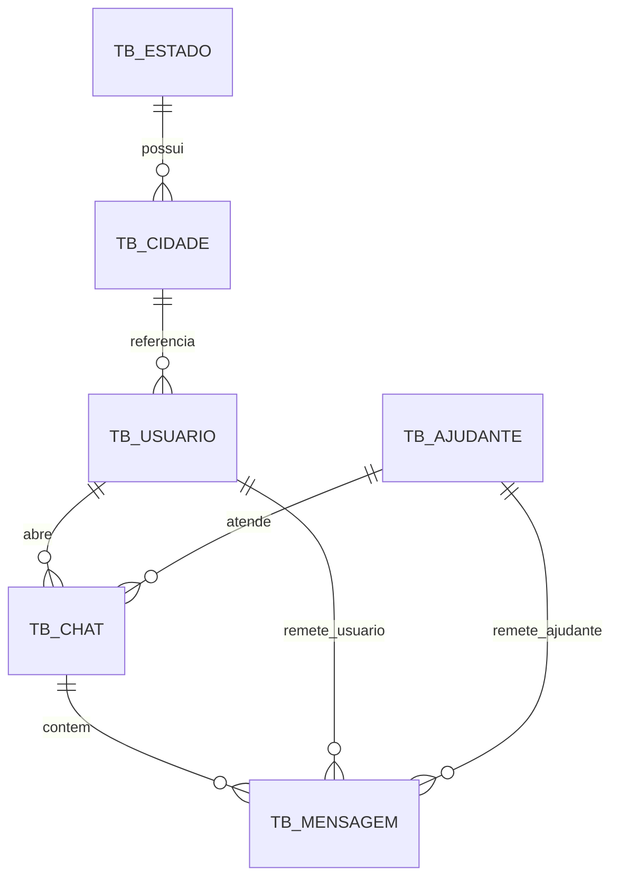
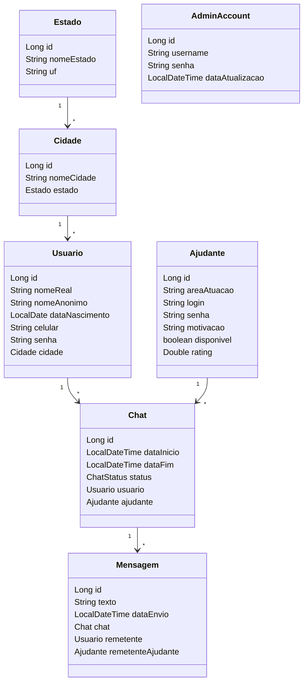

# Modelagem de Dominio e Persistencia

## 1. Visao estrutural
O modelo foi desenhado para suportar atendimento com:
- pessoas atendidas (`Usuario`);
- profissionais de apoio (`Ajudante`);
- sessao de atendimento (`Chat`);
- historico de interacoes (`Mensagem`);
- catalogo geografico (`Estado`, `Cidade`);
- conta administrativa (`AdminAccount`).

## 2. Convencao de nomenclatura Oracle
- Tabelas: prefixo `TB_`.
- Colunas: prefixos por tipo semantico (`ID_`, `NM_`, `DS_`, `TX_`, `DH_`, `DT_`, `NR_`, `FL_`, `SG_`).
- Constraints: `PK_`, `FK_`, `UK_`, `CK_`.
- Indexes auxiliares: `IX_`.

Padronizacao aplicada em migration dedicada:
- `V5__standardize_corporate_naming.sql`

## 3. Entidades e tabelas
| Entidade | Tabela | Papel |
|---|---|---|
| `Estado` | `TB_ESTADO` | Catalogo de estados |
| `Cidade` | `TB_CIDADE` | Catalogo de cidades vinculado a estado |
| `Usuario` | `TB_USUARIO` | Pessoa atendida |
| `Ajudante` | `TB_AJUDANTE` | Perfil de apoio/atendimento |
| `Chat` | `TB_CHAT` | Sessao de atendimento entre usuario e ajudante |
| `Mensagem` | `TB_MENSAGEM` | Mensagens de chat com remetente exclusivo |
| `AdminAccount` | `TB_ADMIN_ACCOUNT` | Conta administrativa da aplicacao |

## 4. Relacionamentos
- `TB_CIDADE.ID_ESTADO -> TB_ESTADO.ID_ESTADO` (N:1)
- `TB_USUARIO.ID_CIDADE -> TB_CIDADE.ID_CIDADE` (N:1)
- `TB_CHAT.ID_USUARIO -> TB_USUARIO.ID_USUARIO` (N:1)
- `TB_CHAT.ID_AJUDANTE -> TB_AJUDANTE.ID_AJUDANTE` (N:1)
- `TB_MENSAGEM.ID_CHAT -> TB_CHAT.ID_CHAT` (N:1)
- `TB_MENSAGEM.ID_USUARIO_REMETENTE -> TB_USUARIO.ID_USUARIO` (N:1, opcional)
- `TB_MENSAGEM.ID_AJUDANTE_REMETENTE -> TB_AJUDANTE.ID_AJUDANTE` (N:1, opcional)

## 5. Regras de integridade importantes
- `TB_CHAT.ST_CHAT` validado por `CHECK` com valores do enum de dominio.
- `TB_CHAT.DH_FIM >= TB_CHAT.DH_INICIO` quando `DH_FIM` informado.
- remetente de mensagem e exclusivo por `CHECK`:
  - ou usuario remetente,
  - ou ajudante remetente,
  - nunca ambos ao mesmo tempo.
- unicidade de login em ajudante e admin.
- unicidade de celular em usuario.

## 6. Diagrama ER (logico)

## 7. Diagrama de classes (visao simplificada)

## 8. Migrations e seeds relevantes
- `V1` a `V5`: estrutura + padronizacao corporativa.
- `V6`: seed de estados/cidades.
- `V7`: seed de credenciais e pessoas.
- `V8`: seed de chats e mensagens de demonstracao.
- `V9`: normalizacao de credenciais legadas em texto puro para BCrypt.

## 9. Observacoes para banca
- A pasta `docs/imagens/` pode receber exportacoes PNG dos diagramas, caso exigido na apresentacao.
- Mesmo sem imagens, os diagramas Mermaid acima descrevem integralmente o modelo atual implementado no codigo e no banco.
